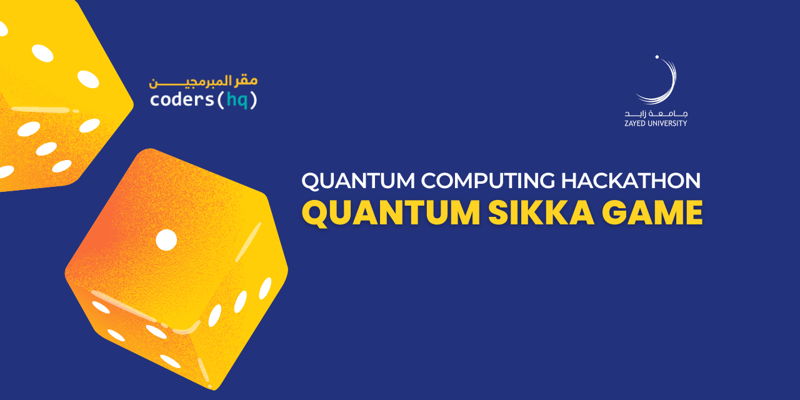

 

# Quantum Sikka Game

## Guide
Quantum Sikka game is a classic board game where players buy, sell, and trade properties to become the wealthiest player. Here is a summary of a Quantum Sikka game that runs for 200 turns with 4 players:

* At the beginning of the game, each player starts with 500 AED in cash and takes turns rolling a pair of dice to move their game piece around the board.
* The game board consists of various properties, including streets, railroads, and utilities that are well known in the UAE. 
* When a player lands on a property, they can choose to buy it, pay rent if it's already owned by another player, or choose to auction it off to the highest bidder.
* Players can also land on special spaces that trigger different events, such as chance or Sekka community chest cards, income tax, or jail.
* As players acquire more properties, they can start building houses and hotels on them to increase the rent they collect from other players who land on those spaces.
* The game continues with players taking turns rolling the dice, moving around the board, and making strategic decisions to accumulate wealth.
* As the game progresses, players may face financial difficulties, such as landing on high-rent properties they can't afford or drawing unfavorable chance or community chest cards.
* The game ends after 200 turns, and the player with the most money and property value at the end of the game is declared the winner.
* Overall, Quantum Sekka is a fun and challenging game that requires strategic thinking and a bit of luck to succeed. With 4 players and 200 turns, the game is likely to be full of twists and turns, unexpected events, and intense competition.

## Quantum Principles
When the player lands on a property that has a value of superposition, they would have to draw a card that lists the different possible rent values for the property. The player would then need to roll the dice to collapse the superposition and determine the actual value of the property, which would be used to calculate the rent. The player must pay rent based on the corresponding value for as long as they remain on the property. The rent would be set at 10% of the actual value after the dice is rolled.

Quantum Principles: 
* Superposition - property is in multiple states (rent value) . 
* Wave length collapse  - determine the 'actual' value of the property . 
* Measurement (cards)  - when a system interacts with the dice and causes it to reach a collapse

### How to play?
1. Set up a team made of 4 members
2. Choose your character
3. Each player will have 500 AED to start
4. The system will randomly choose the first player
5. Roll the dice and move your game piece
6. Read the space you landed on and buy property or pay rent
7. Buy an unowned property when you land on it if you’d like
8. Collect (or pay) rent when a player lands on owned property
9. Go to jail when you’re instructed to
10. Make deals with other players at any time.
11. After 200 turns, the game will end and announce the winner
