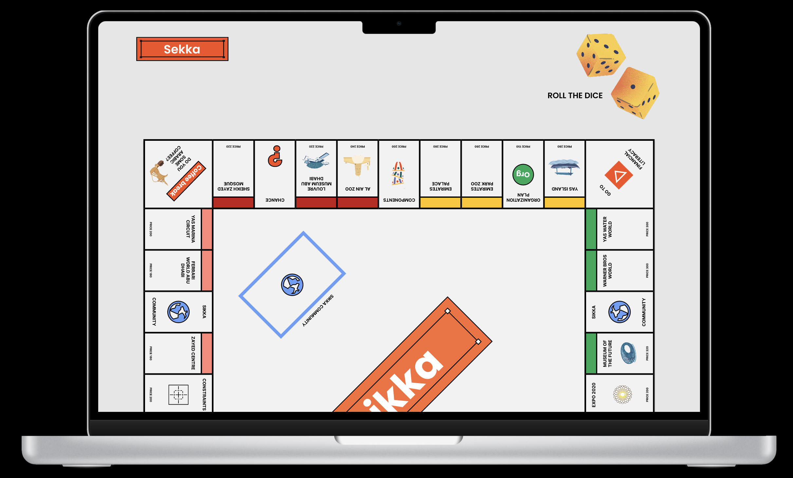
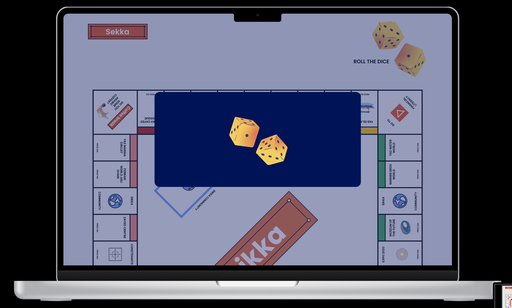
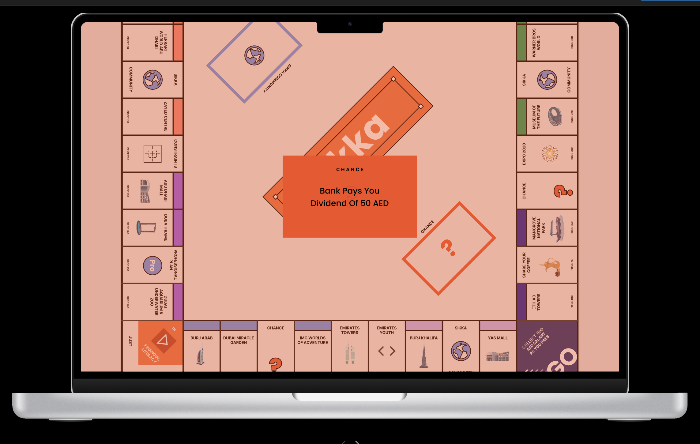

 

# Quantum Sikka Game

## PROJECT TITLE:
* Quantum Sikka Game
* Tag line: Take a chance on the unpredictable world of quantum Sikka!
* Sikka is an online quantum board game that leverages quantum mechanics principles like superposition, challenging players to navigate uncertainty to become the wealthiest player. It cultivates the player's critical thinking skills by requiring players to think outside the box and approach decision-making in a new way that mimics real-life financial markets.

## PROJECT DESCRIPTION:
### Why did we build this project and what was our motivation?
Our motivation to build the quantum Sikka game for CodersHQ Quantum Computing Hackathon was to showcase the potential of quantum computing in a relatable and engaging way, and to help individuals without technical backgrounds understand the principles of quantum mechanics and computing. We wanted to create an experience that would inspire innovation and interest in this emerging technology among both developers and the general public, and provide a platform for exploring the practical applications of quantum computing in areas such as finance and real estate which we leverage to promote financial literacy and strategic thinking. We believe the quantum Sikka game has the potential to be a valuable tool for education, exploration, and innovation in the field of quantum computing, and we are excited to share our vision with others.

### Problem statement:
In the United Arab Emirates (UAE), there is a lack of understanding of quantum mechanics principles such as superposition among the general public. Additionally, there is a need to increase financial literacy and promote the use of effective financial strategies among residents. In quantum mechanics, superposition refers to the ability of a quantum system to exist in multiple states simultaneously. This concept of uncertainty is also prevalent in the world of finance, where investors are often faced with unpredictable market conditions and uncertain outcomes when making investment decisions. This feature is showcased in the game of Sikka where the properties in the game are in a superposition of value, affecting their worth and characteristics. Ultimately, this game can contribute to the growth of the UAE's economy and innovation within Quantum Computing.

### What will your users learn from this game about Quantum Computing? 
At Sikka, our players will gain an in-depth understanding of the interactions between the quantum principles including superposition, collapse, wavelength, and measurement which are demonstrated in the Sikka gameplay. 
* Superposition: the ability of a quantum particle to exist in multiple states is showcased by the altering values of the properties.
* Wavelength: the wavelength is relevant to the uncertainty principle which states that the more precisely the particle position is known, the less precisely its momentum can be known. In terms of Sikka, the value of the property cannot be predicted until the wavelength collapses (i.e. the player lands on the property and takes action), which can affect the player's financial strategy and make the game more challenging!
* Collapse: the process of measuring a quantum particle's state which is showcased when the property collapses into an unpredictable single value from the dice roll.
* Measurement: the outcome of a measure of a quantum system depends on the probabilities of different states which is depicted in the Superposition of Value property cards.

### What are the features of your project?
1) At the beginning of the game, each player starts with 500 AED in cash and takes turns rolling a pair of dice to move their game piece around the board.
2) The game board consists of various properties, including streets, railroads, and utilities. 
3) When a player lands on a property, they can choose to buy it, pay rent if it's already owned by another player, or choose to auction it off to the highest bidder.
4) Players can also land on unique spaces that trigger different events, such as Superposition of Value, chance or Sikka community chest cards, income tax, or financial literacy.
5) As players acquire more properties, they can start building houses and hotels on them to increase the rent they collect from other players who land on those spaces.
6) The game continues with players taking turns rolling the dice, moving around the board, and making strategic decisions to accumulate wealth.
7) As the game progresses, players may face financial difficulties, such as landing on high-rent properties they can't afford or drawing unfavorable chances or community chest cards.
8) The most money and property value at the end of the game is declared the winner.

## Features of Quantum Sikka Properties:
1) When the player lands on a property that has a value of superposition, they would have to draw a card that lists the different possible rent values for the property.
2) The player would then need to roll the dice to collapse the superposition and determine the property's actual value, of which the rent would be 10% of the actual value.
3) The player must pay rent based on the corresponding value for as long as they remain on the property.

## Visualization of Demo gameplay
 

## Install and run the project
1) To run Figma File: You can check this link: [Quantum Sikka Game](https://www.figma.com/proto/Pw7bHofXzoEEksgDaCFD7M/Quantum-Sikka-Game?node-id=2%3A2&scaling=scale-down&page-id=0%3A1&starting-point-node-id=2%3A2)

2) To run HTML File: You need to download NetBeans and paste the code.

3) To run the Quantum Code:
  * Step 1: Install qiskit and pylatexenc:
  ```bash
  !pip install qiskit
  !pip install pylatexenc
  ```
  * Step 2: Import Dependencies
  ```bash
  from qiskit import *
  from qiskit.providers.aer import *
  from math import *
  from qiskit.visualization import plot_histogram
  from qiskit.providers.ibmq import IBMQ, least_busy
  from qiskit.quantum_info import Statevector
  ```
4) To run the Python Code: 
  * Step 1: Download Pycharm
  * Step 2: Install numpy
  ```bash
  pip3 install numpy
  ```
  * Step 3: Improt numpy in your python code
  ```bash
  import numpy as np
  ```
## How to use the project in Figma?
* Step 1: Click on [Quantum Sikka Game](https://www.figma.com/proto/Pw7bHofXzoEEksgDaCFD7M/Quantum-Sikka-Game?node-id=2%3A2&scaling=scale-down&page-id=0%3A1&starting-point-node-id=2%3A2)

* Step 2: Choose one of the option
 

* Step 3: For more information about the game choose 'Learn More'. It will display a page with the information.
  

* Step 4: You can start the game by clicking on 'Start' button.
  

* Step 5: To role the dice, Click on the dice image.
  

* Step 6: If you need to read the Sikka Community card or chance card, just click on them.
  
